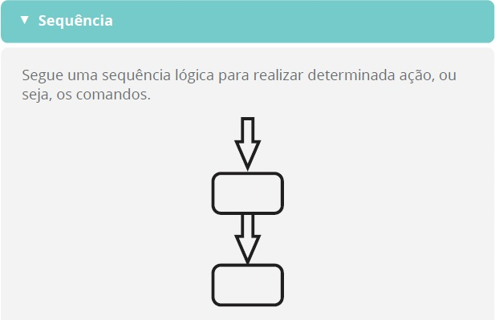

# Introdução a Programação Orientada a Objetos (POO)
## Programação estruturada x orientação a objetos
Para entender as diferenças entre as duas programações, é necessário entender os conceitos de cada uma.  
Ambos são o que chamamos de paradigmas de programação, ou seja, modos de programar, e cada paradigma é 
diferente do outro. Entenda que apesar de ambos terem o mesmo objetivo, que é programar para computadores, cada um tem seu jeito particular de pensar.  
  
Vamos entender melhor como é a programação estruturada e como ela funciona?

### Programação estruturada
Este tipo de programação segue uma lógica e sequência de pensamentos de uma máquina. Ou seja, a sua lógica é direcionada à linguagem de máquina, já que ela realiza o que foi orientado pelo programador por meio de uma linguagem estruturada.  
Para saber mais sobre isso, observe as imagens abaixo que representam fluxogramas (símbolos para representação de regras e procedimentos lógicos que levam a solução de um problema) de três interações que iremos aprofundar mais a frente do curso: sequência, decisão e iteração. 
     
  
  
  
  
  
  
A programação estruturada segue processos, uma sequência contínua de fatos, para atingir seu objetivo final, que é a solução
de um determinado problema. Quando há um programa a ser desenvolvido, onde várias etapas precisam ser cumpridas, esse programa é dividido em vários processos pequenos e depois que todos estão resolvidos, os juntamos para formar a resolução final do problema.  
  
Para entender de forma mais clara o conceito apresentado, observe o seguinte exemplo:  
Em uma pizzaria, você trabalha como pizzaiolo, e o problema que precisa resolver é o de fazer uma pizza de calabresa. Muitos processos devem ser realizados para que você consiga realizar sua tarefa, não é mesmo?  
Para isso você segue, passo a passo, cada uma das atividades, como:  
<ol>
    <li>Preparar a massa;</li>
    <li>Colocar o recheio;</li>
    <li>Ligar o forno, se não estiver ligado;</li>
    <li>Colocar a pizza para assar;</li>
    <li>Retirar a pizza do forno depois de 10 minutos.</li>
</ol>  
Pronto, você conseguiu preparar a pizza de calabresa corretamente.  
É assim que funciona a programação estruturada, ela é realizada por sequência como a preparação de uma pizza!  
  
### Programação Orientada a Objetos  
Enquanto a programação estruturada obedece a uma lógica de máquina, a programação orientada a objetos funciona de um modo mais similar ao raciocínio humano. Os seus códigos são organizados de acordo com objetos, e não processos, como no caso da programação estruturada.  
  
O modo de programar orientado a objetos surgiu da necessidade de deixar a programação mais fácil, possibilitando ao desenvolvedor entregar um software que satisfaça completamente o cliente. Algo muito difícil e às vezes, quase impossível, com a programação estruturada.  
Para que isso ocorra, é necessário que você, como programador, ensine a máquina a pensar como os seres humanos, mostrando como o nosso mundo funciona.  
Certo, mas como se faz isso?  
Primeiro, você precisa compreender alguns conceitos!  

**Objeto**  
São elementos do mundo real para o mundo da programação. O objeto é criado a partir de uma classe. É algo que se visualiza, se utiliza e assume um papel no domínio do problema. Um exemplo disso, é um Fusca 1964.  

**Atributos**  
São as características do objeto. Considerando o exemplo do Fusca 1964, os atributos deles são: ano de fabricação é 1964 e que ele tem um formato arredondado e o motor fica na parte traseira.  

**Métodos**  
São os comportamentos do objeto. Ainda de acordo com o exemplo, o Fusca pode se locomover, transportando pessoas, cargas etc.  

**CLasses**  
São os agrupamentos que descrevem todos os objetos de um único tipo. Por exemplo, o fusca pertence à classe dos carros. Não importa a sua marca ou ano. O que importa é que são objetos que se encaixam nesta classe, que serve como molde para a criação dos objetos. É na classe que são moldados os objetos que serão utilizados do programa a ser desenvolvido.  

### Os 4 pilares da Programação Orientada a Objetos
Agora você aprofundará mais seus conhecimentos, sobretudo, estudando sobre alguns elementos que o ajudará a entender melhor a
programação orientada a objeto, explicando seus quatro mais importantes componentes: abstração, encapsulamento, herança e polimorfismo.  

#### Abstração
Na POO, damos o nome de abstração para o processo de aproximar o mundo real do mundo da programação, sendo o seu objetivo, simplificar um problema difícil. Para isso, a abstração leva em conta os aspectos importantes de um determinado ponto de vista e desconsidera os aspectos restantes.  

A abstração é a criação de uma classe abstrata, que é uma classe incompleta, como se fosse um quebra-cabeça. Esta classe não permite a criação de instâncias e obriga a implementação de todos os métodos da classe assinados como ‘abstract’.  

Resumindo, a abstração se concentra apenas nas informações que são importantes para o seu propósito. Dessa forma, ela mantém suas classes o mais simples possível, concentrando-se apenas no que é importante para uma determinada finalidade.  
A abstração nada mais é do que você abstrair coisas, ou seja, quando você tem algo muito grande, mas não há necessidade de cadastrar todas as informações.
Mais a frente no curso entenderemos melhor esse conceito (Unidade 3).  

#### Encapsulamento
Ao encapsular algo, você está colocando um objeto dentro de um recipiente, igual a um remédio de cápsula.  

Mas, afinal, qual é o propósito?  
O encapsulamento é uma das principais técnicas da programação orientada a objetos. Quando você encapsula um objeto, você está criando uma proteção e um padrão. Com isso, o propósito é de proteger o desenvolvedor do código e o código do desenvolvedor. Assim, quando você encapsula um objeto na POO, você está criando moldes padrão que fazem com que o conteúdo do objeto não importe. Você está determinando que o resultado será sempre o mesmo.

**Conceito de encapsulamento**  
É a ação de ocultar partes independentes da implementação, permitindo construir partes invisíveis ao mundo exterior.  
Ok, mas se no fim eu estou ocultando detalhes do código, como que ele vai funcionar? A POO permite que você converse com esta cápsula, trocando informações entre o mundo externo e o objeto por meio de mensagens. Portanto, ao enviar mensagens para essa cápsula, você vai obter uma resposta, sem precisar entrar nela.  
Mas não podemos esquecer de um importante detalhe! Para que haja esta troca de mensagens, precisamos desenvolver uma interface. É a interface que permite esta comunicação com o mundo externo.  

**Conceito de interface**  
É uma lista de serviços fornecidos por um componente. É o contato com o mundo exterior, que define o que pode ser feito com um objeto de determinada classe. Ou seja, a interface é uma classe composta apenas por métodos (não possui atributos).  

**Atenção**  
Encapsular não é obrigatório na POO, mas é uma ótima prática para produzir classes mais eficientes.
Anteriormente, você aprendeu sobre abstração, certo? Que nada mais é do que simplificar uma classe, se concentrando apenas em informações importantes e relevantes para o propósito do código.  
No encapsulamento esse conceito é muito importante, já que os métodos da classe encapsulada serão abstratos, ou seja, os métodos abstratos são previstos ali, mas não são implementados na interface.  

Para entender melhor esse processo, pense, por exemplo, nas máquinas de café
expresso nas padarias.  
Como ela é feita, não é algo que precisamos saber para poder obter o resultado do processo (nosso café quentinho). Por isso, a máquina é um objeto encapsulado, onde os ingredientes e o mecanismo do preparo do café ficam escondidos atrás da interface externa da máquina, composta por botões de comando (como ligar, desligar, tipos de bebida etc.) que auxiliam na preparação.

#### Herança  
Outro pilar da POO é a herança. Assim como no mundo real, a herança na POO também diz respeito à ação de herdar. Ela nada mais é do que um objeto poder ser criado em uma outra classe, levando consigo todos os atributos já existentes em sua classe de origem.  
A herança é uma maneira de reutilizar o código já existente em uma nova classe. Desta forma, o código é aprimorado com novas e melhores capacidades. Ao utilizar este pilar, os programadores economizam tempo de desenvolvimento de um programa, já que eles reutilizam códigos já testados e aprovados.  
No organograma abaixo, mostra um exemplo de herança. Ao analisá-la, percebe-se que as classes herbívoro, carnívoro e onívoro podem herdar quaisquer atributos necessários da classe animal: tamanho, raça, cor etc. Da mesma forma, as classes leão, hiena, homem e coelho podem herdar atributos das classes herbívoro, carnívoro ou onívoro.  

   

#### Polimorfismo
O polimorfismo é um pilar da POO que é utilizado para que duas classes façam uso do mesmo método, implementando-o de formas diferentes. Ele permite que o programador desenvolva o código de forma ampla ao invés de perder muito tempo no desenvolvimento de códigos específicos. Ou seja, o polimorfismo permite que sistemas sejam escritos de forma a processar objetos que compartilham a mesma superclasse (classe já existente), como se eles fossem parte direta dela.  
Por exemplo, na superclasse Animal, estabelecemos o método “emitir o som do objeto animal”, ou seja, os objetos pato, cachorro e gato devem emitir um som ao comando do método, mas cada um fará isso de um jeito diferente.  
Agora, vejamos outro exemplo, onde foi desenvolvido um programa para o estudo
que simula o modo de locomoção de animais com as classes Peixe, Anfíbio e Pássaro. Cada uma dessas classes é extensão da superclasse Animal, que possui o método “mover” e controla a localização destes seres. Para simular a locomoção, o programa manda a mesma mensagem (mover) a cada objeto. Porém, cada uma das classes (tipo de animais) responde ao comando de um jeito diferente: o peixe nada, o anfíbio pula e o pássaro voa.
Observe que nos exemplos apresentados, o polimorfismo foi este processo de implementar métodos (emitir som e mover) na superclasse Animal, para que as classes (pato, cachorro e gato; peixe, anfíbio e pássaro) possam obedecer a um mesmo comando, mesmo que de maneiras diferentes.  

## Instalação do Java JDK e Eclipse   
### Java JDK  
Existem várias versões do Java JDK, pois em curtos períodos são lançadas versões de curto suporte para que a comunidade teste novos recursos e outras atividades, porém sempre iremos instalar a versão mais atual que tenha "LTS", que é a versão de longo período de suporte. Até o momento, a versão LTS mais atual é a 21.
Para fazer a instalação do Java JDK (Java Development Kit), buscaremos por uma distribuição gratuita, neste caso será a zulu, através deste link:  
https://www.azul.com/downloads/?package=jdk#zulu  

Baixe o arquivo .zip da versão 21 (LTS) para Windows x86 64 bits.  
Com o arquivo baixado, abra a pasta onde ele foi salvo e abra o arquivo com o descompactador de sua preferência.  
Abra o seu drive (C:) > Arquivos de Programas.  
Se não houver uma pasta "Java" crie neste momento.  
Deve estar da seguinte forma:  
  
Com a pasta Java aberta, você pode descompactar o arquivo simplesmente arrastando do descompactador para a pasta.  

**Configurando variáveis de ambiente**  
Na sua barra de pesquisa do windows, digite "var" e abra "Editar as variáveis de ambiente do sistema".  
Na aba "Avançado" abra "Variáveis de Ambiente...":  
  

Em "Variáveis do Sistema", caso não haja uma variável "JAVA_HOME", cliem em "Novo...":  
  

Em "Nome da variável" escreva exatamente "JAVA_HOME" (sem as aspas).  
Para atribuir o "Valor da variável" copie e cole o caminho da pasta do arquivo que foi salvo na pasta "Java" em "Arquivos de programa":  
  
  
Clique em "ok" para salvar a nova variável.  

Clique uma vez na variável "Path" e clique em "Editar":  
  
Copie novamente o caminho do arquivo, clique em "Novo" e cole o caminho do arquivo. adicione \bin depois do caminho copiado.  
Clique fora para salvar, clique uma vez nessa nova variável e clique em "Mover para cima" até que ele fique no topo, para evitar conflito com alguma outra versão.  
O ambiente deverá ficar dessa forma:  
  
Clique em "Ok" para salvar as alterações em cada aba.  

Para verificar se está funcionando, abra o prompt de comando digitando "cmd" na pesquisa do windows e nele digite "java -version", dê enter e deverá ter a seguinte responsta:  
  

### Eclipse  
Para instalar o Eclipse, que será nosso ambiente de desenvolvimento Java neste curso, acesse:  
https://www.eclipse.org/downloads/packages/  
Localize a versão mais recente de "Eclipse IDE for Enterprise Java and Web Developers".  
  

Com o download concluído, abra o arquivo .zip e descompacte a pasta "eclipse" no disco local. Depois de descompactado, só abrir a pasta e iniciar o eclipse.exe.  
Quando o eclipse está abrindo ele pede para selecionar um diretório como "workspace", que é basicamente selecionar uma pasta onde seus projetos serão salvos.  
Dica: Crie uma pasta chamada "ws-eclipse" ou com nome parecido para sempre estar salvando seus projetos criados no eclipse, para que não misture com projetos de outra IDE que possa vir a utilizar, mantendo, assim, sua organização.s