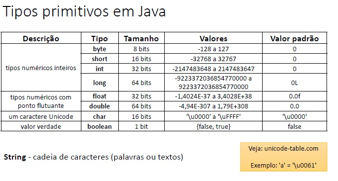
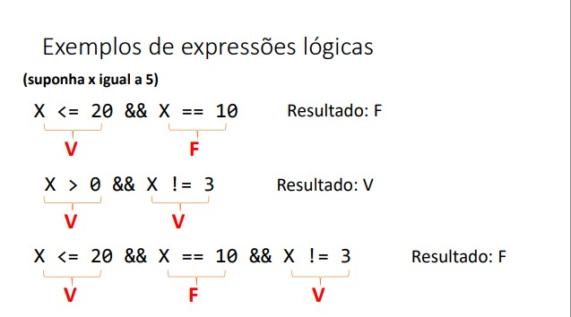

# Estrutura Sequencial
## Expressões aritméticas

Expressões aritméticas são aquelas que, quando calculadas, o resultado nos retornará um valor numérico, por exemplo:  

4 + 5 --resultado-> 9

Para construir expressões aritméticas é preciso conhecer os operadores aritméticos mais comuns que são adição, subtração, multiplicação, divisão e resto da divisão (mod).  

Esses operadores tem uma regra de precedência entre eles.  
Os operadores * / e % tem uma precedência maior, ou seja, eles são feitos em primeiro lugar em relação aos operadores de + e -.

Observe nos exemplos acima que os resultados estão corretos quando utilizamos a precedência da forma correta, lembrando que o uso do parênteses () é uma forma de quebrar a precedência, quando temos uma soma dentro de parênteses seguido de uma multiplicação, a soma é realizada primeiro, como no terceiro exemplo.  

Ja o operador % (mod) retorna para nós o resto de uma divisão. Note no exemplo 1 acima que 14 % 3 tem como resultado 2, pois o resto da divisão de 14 por 3 é igual a 2.  

## Variáveis e tipos básicos em Java

<b>Definição Informal:</b> Em progamação, uma variável é uma porção de memória (RAM) utilizada para armazenar dados durante a execução dos programas.  

### Declaração de Variáveis

<b>Sintaxe:</b>  
tipo nome = valor inicial;  
obs: O "volor inicial" é algo opcional, uma variável pode ser declarada sem valor inicial, sendo declarado somente seu tipo e nome seguido de ponto e virgula (;).  

<b>Exemplos:</b>  
    int idade = 25;  
    double altura = 1.68;  
    char sexo = 'F';  

Nestes exemplos há 3 tipos de variáveis:  
<b>int</b> - É um tipo de dados que corresponde a um número inteiro, ou seja, em uma variável do tipo int, só podemos armazenar números inteiros.  
<b>double</b> - É um tipo de número com ponto flutuante, ou seja, casas decimais.  
<b>char</b> - É um tipo de dados que corresponde a um caractere, pode ser uma letra, um tipo de pontuação, ou qualquer caractere do computador.  

A tabela a seguir apresenta os tipos de variáveis primitivos da programação.

  

### Nomes de variáveis  

Para dar nomes às variáveis, você deve seguir algumas regras:  
<ul>
<li>Não pode começar com dígito: use uma letra ou _</li>
<li>Não pode ter espaço em branco</li>
<li>Não usar acentos ou til</li>
<li>Sugestão: use o padrão "camel case"</li>  
</ul>
O padrão "camel case" consistem em escrever a primeira palavra toda com letras minusculas e dar letras maiúsculas para a primeira letra das palavras seguintes, sem utilizar espaços em branco. Segue alguns exemplos de delcaração de variáveis. 

Errado: int 5minutos; ---> Correto: _5minutos;  
Errado: int salário; ---> Correto: int salario;  
Errado: int salário do funcionario; ---> Correto: int salarioDoFuncionario;  

## As três operações básicas de programação  
Um programa de computador é capaz de realizar essencialmente três tipos de operações: Entrada de dados, Processamento de dados e Saída de dados.  

<b>Entrada de dados: </b>É quando o usuário informa dados para o programa, que serão armazenados em variáveis, através de um dispositivo de entrada, como o teclado. Também chamamos de Leitura, ou seja, o programa está lendo dados.  
<b>Processamento de dados: </b>É quando o programa realiza os cálculos. Ocorre dentro do processador do computador.  
<b>Saída de dados: </b>É quando o programa informa dados para o usuário através de um dispositivo de saída, como o monitor. Também é chamado de Saída, ou seja, o programa está escrevendo dados.  

### Saída de dados em Java  
Para escrever na tela um texto qualquer, utilizamos dois comandos básicos.  
Sem quebra de linha no final: System.out.print("Bom dia!");  
Com quebra de linha no final: System.out.println("Bom dia!");  

Exemplo:  

    public class Main {  
        public static void main(String[] args) {  
            System.out.println("Olá Mundo!");  
            System.out.print("Bom Dia!");  
        }  
    }  

Para escrever o conteúdo de uma variável de algum tipo básico.  
Suponha uma variável do tipo int declarada e iniciada:  

int y = 32;  

Para escrever o valor dessa variável na tela, use:  

System.out.println(y);  

Note que nesse exemplo, não se utiliza das aspas duplas para escrever.  
  
Para escrever o conteúdo de uma variável com ponto flutuante.  
Suponha uma variável tipo double declarada e iniciada: 

double x = 10.35784;  

Para escrever o valor da variável por completo basta utilizar o mesmo print do exemplo de int:  
System.out.println(x);  
  
Há outras formas de mostrar esse número com a quantia de casas decimais que desejar, substituindo o "println" por "printf", onde "f" significa "format", ou seja será valor formatado. Para tal, deve-se abrir o parenteses, abre aspas duplas e escreve "%.2f" para indicar um numero formatado com duas casas decimais, fecha aspas, segue uma virgula e o nome da variável.  

    public class Main {
        public static void main(String[] args) {

            double x = 10.35784;

            System.out.println(x);
            System.out.printf("%.2f%n", x);
            System.out.printf("%.4f%n", x);
        }
    }

Obs: %n = quebra de linha (independente da plataforma)  

Para concatenar, ou seja, juntar vários elementos em um mesmo comando de escrita:  

Regra geral para <b>print</b> e <b>println</b>:  
elemento1 + elemento2 + elemento3 + ... + elementoN  

System.out.println("RESULTADO = " + x + " METROS");  

Regra geral para <b>printf</b>  
"TEXTO1 %f TEXTO2 %f TEXTO3", variável1, variavel2  

System.out.printf("RESULTADO = %.2f metros%n", x);

### Processamento de dados em Java, Casting
O processamento de dados em qualquer linguagem de programação é feito através de um comando de atribuição.  

<b>Sintaxe:</b>  
variável = expressão;  

Do lado esquerdo escrevemos a variável, seguido de = (Lê-se "recebe"), e do lado direito a expressão.  
Primeiramente o programa irá calcular a expressão e em seguida armazenará o resultado na variável desejada. Ou seja, a variável recebe o valor da expressão.    

    public class Main {
        public static void main(String[] args) {
            int x;
            double y;

            x = 5;
            y = 2 * x;

            System.out.println(x);
            System.out.println(y);
        }
    } 

No exemplo acima a variável int x recebe o valor 5 e a variável y recebe o resultado de 2 multiplicado por x no tipo double, ou seja, com ponto flutuante, e irá imprimir na tela o resultado com o ponto flutuante.  

### Entrada de dados em Java  
A entrada de dados em um programa ocorre quando digitamos algum dado no teclado e pressionamos enter, informando para o programa qual o valor que queremos atribuir para uma determinada variável.  
Suponha que temos um programa com uma variável declarada int x; o que queremos é digitar um valor inteiro no teclado e pressional enter para armazenar esse valor digitado naquela variável.  

O Java tem uma particularidade para se fazer entrada de dados, iremos criar um objeto do tipo "Scanner" da seguinte forma:  

Scanner sc = new Scanner(System.in);  

Para essa variável do tipo Scanner funcionar, coloque no começo do programa  
import java.util.Scanner;  

E faça um sc.close() quando não precisar mais do objeto sc. sc é a variável e .close é uma função que vai desalocar esse recurso criado.  

<b>Para ler uma palavra (texto sem espaços):</b>  

Suponha uma variável tipo String declarada:  
String x;  

O que queremos é que o conteúdo que digitamos entre nessa variável x, para isso fazemos:  

x = sc.next();  

Veja na prática:  

    import java.util.Scanner;

    public class Main {
        public static void main(String[] args) {
            Scanner sc = new Scanner(System.in);

            String x;
            x = sc.next();
            System.out.println("Você digitou: " + x);

            sc.close();
        }
    }

Assim que rodar o código em sua IDE, ele irá parar e aguardar que digite algo, tente digitar seu nome e em seguida teclar enter para ver que o programa continuará imprimindo o nome no lugar da variável.  

<b>Para ler um número inteiro:</b>  

Suponha uma variável declarada:  
int x;  

Para armazenar um número inteiro nesse x, utilize:  

x = sc.nextInt();

<b>Para ler um número com ponto flutuante:</b>  

Suponha uma variável declarada:  
double x;  

Para armazenar um numero com ponto flutuante nesse x, utilize:  

x = sc.nextDouble();  

<b>Para ler um caractere:</b>  

Suponha uma variável declarada:  
char x;  

Para armazenar um caractere nesse x, utilize:  

x = sc.next().charAt(0);  

É importante pontuar que .charAt(0); é utilizado para que pegue apenas a primeira letra no caso de digitar mais de uma letra.  

<b>Para ler um texto até a quebra de linha:</b>

A idéia é que possamos digitar várias palavras ou valores e assim que apertar o enter, todo o conteúdo vá para uma variável do tipo String.  

import java.util.Scanner;

    public class Main {
        public static void main(String[] args) {
            Scanner sc = new Scanner(System.in);

            String s1, s2, s3;

            s1 = sc.nextLine();
            s2 = sc.nextLine();
            s3 = sc.nextLine();

            System.out.println("DADOS DIGITADOS:");
            System.out.println(s1);
            System.out.println(s2);
            System.out.println(s3);

            sc.close();
        }
    }

Ao rodar o programa ele irá parar aguardando que digite algo, tente digitar mais de uma palavra e quando teclar enter, escreva novamente, e novamente, até que ele imprima na tela de acordo com a quantida de scanners que foram solicitados, no caso do exemplo, serão 3.  

  

### Exercício:  
  

Tente resolver o exercício e depois compare com a resolução a seguir:  

    import java.util.Locale;
    import java.util.Scanner;

    public class Main {

        public static void main(String[] args) {

            Locale.setDefault(Locale.US);
            Scanner sc = new Scanner(System.in);

            double A, B, C, triangulo, circulo, trapezio, quadrado, retangulo;

            A = sc.nextDouble();
            B = sc.nextDouble();
            C = sc.nextDouble();

            triangulo = A * C / 2.0;
            circulo = 3.14159 * C * C;
            trapezio = (A + B) / 2.0 * C;
            quadrado = B * B;
            retangulo = A * B;

            System.out.printf("TRIANGULO: %.3f%n", triangulo);
            System.out.printf("CIRCULO: %.3f%n", circulo);
            System.out.printf("TRAPEZIO: %.3f%n", trapezio);
            System.out.printf("QUADRADO: %.3f%n", quadrado);
            System.out.printf("RETANGULO: %.3f%n", retangulo);

            sc.close();
        }
    }

## Funções matemáticas em Java  

A tabela a seguir apresenta algumas funções matemáticas que podem ser utilizadas em diversos códigos.  

  
  
   
## Expressões Comparativas Java:  

Como o nome sugere, são expressões que comparam duas coisas, sempre nos mostrando um resultado verdadeiro ou falso, ou seja, um valor verdade.  
Estes são os seguintes operadores comparativos:  

  

Considere a seguinte suposição (x = 5), ao analisar as alternativas abaixo podemos exemplificar como funcionam os operadores em uma expressão comparativa:  

X > 0			Resultado: Verdadeiro  
X == 3			Resultado: Falso  
50 <= 100		Resultado: Verdadeiro  
X != 5			Resultado: Falso  

##  Expressões Lógicas Java:  

Assim como as expressões comparativas, as expressões lógicas quando avaliadas resultam em um valor verdade, verdadeiro ou falso.  
Temos os seguintes operadores lógicos:   

&& - E (and) : A ideia por trás deste operador é de que todas as condições devem ser verdadeiras dentro de uma expressão lógica para que esta seja verdadeira;  
Por exemplo:  

  

<b>OR</b> - A ideia por trás deste operador lógico, é de que no mínimo uma condição deve ser verdadeira numa expressão para que ela seja verdadeira.  

Por exemplo:  

"suponha x igual a 2"  

    x == 3 || x <= 38 		Resultado  = Verdadeiro  

Pois a "x <= 38" é verdadeira e "x == 3" é falsa, logo quando há ao menos uma condição verdadeira, a expressão também será verdadeira.  

<b>NÃO</b>: Este operador inverte a condição;  

Por exemplo:  

"suponha x igual a 5" 

    ! x == 8	Resultado: Verdadeiro  
    ! x >= 2	Resultado: Falso  

Pois se a condição for Falsa, se tornará verdadeira, e vice versa, se for verdadeira se tornará falsa.