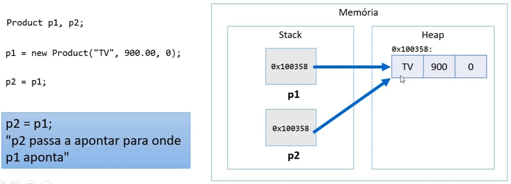
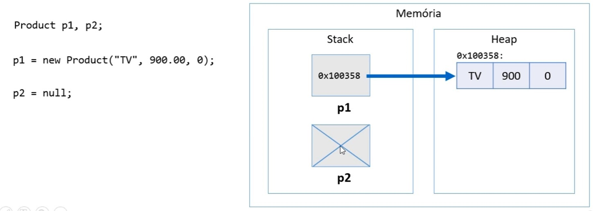
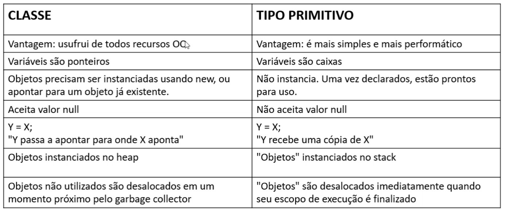
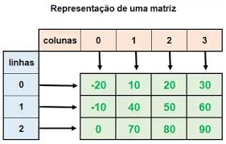

# Vetor e Matriz  
## Tipos referência vs tipos valor  
**Classes são tipos referência**  
Variáveis cujo tipo são classes não devem ser entendidas como caixas, mas sim "tentáculos" (ponteiros) para caixas.  
O que isso quer dizer?  

Vamos supor que temos duas variáveis Product p1 e p2. Essas duas estarão alocadas em uma área de memória chamada "Stack", que é uma área de memória que aloca as variáveis que você declara no seu programa. Ou seja, no Stack teremos duas "caixinhas" p1 e p2.  
Quando se faz p1 = new Product ("TV", 900.00, 0), passando valores os valores para a variável, o que acontece é que será alocado um objeto numa outra área de memória chamada Heap, que é uma área de memória em que são alocados os objetos em tempo de execução. Isso se chama alocação dinâmica de memória.  
O que acontece é que essa variável não vai guardar os valores em si, ela guarda o endereço de memória correspondente ao endereço de memória onde estiver o objeto que foi alocado.  
Quando fazemos p2 = p1. p2, também, não guarda os valores e sim aponta para o mesmo endereço de memória, ou objeto, que p1 aponta, ou seja, é uma referência ao objeto.  
Por isso que variáveis do tipo classes são tipos referência, pois elas apontam para um objeto alocado no heap.  

Veja a imagem a seguir para ilustrar esse conceito:  
  

**Valor "null"**  
Tipos referência aceitam o valor "null", ou nulo, que indica que a variável aponta para ninguém.  
É possível inicial uma variável, que é uma referência, indicando que ela ainda não aponta para nenhum objeto.  
  

**Tipos primitivos são tipos valor**  
Em Java, tipos primitivos são tipos valor. Tipos valor são CAIXAS e não ponteiros.  

Agora temos uma situação diferente. Suponha que temos duas variáveis x e y primitivas do tipo double, double é um tipo primitivo do Java, como visto anteriormente na Unidade 2. Isso significa que essas variáveis serão caixinhas alocadas na área de memória chamada Stack e dentro dessas caixinhas serão guardados um valor do tipo double e não uma referência a algo que está em outro lugar.  
  

Aqui temos uma diferença muito importante entre o tipo referência e o tipo valor. Quando há a atribuíção y=x, y está recebendo uma cópia do valor de x, então não é simplesmente uma referência.  

**Valores padrão**  
Quando alocamos (new) qualquer tipo estruturado (classe ou array), são atribuídos valores padrão aos seus elementos, ou seja, caso não seja atribuído nenhum valor no objeto, haverão valores iniciais padrão estabelecidos pelo Java, esses serão:  
    <ul>  
        <li>números: 0</li>  
        <li>boolean: false</li>
        <li>char: caractere código 0</li>
        <li>objeto: null</li>
    </ul>  

A imagem a seguir mostra um resumo das diferenças entre os tipos referência e tipo valor:  
  

## Vetores  
<ul>
    <li>Em programação, "vetor" é o nome dado a arranjos unidimensionais</li>
    <li>Arranjo (array) é uma estrutura de dados:</li>
        <ul>
            <li>Homogênea (dados do mesmo tipo)</li>
            <li>Ordenada (elementos acessados por meio de posições, a primeira posição é a posição 0)</li>
            <li>Alocada de uma vez só, em um unico bloco contíguo de memória</li>
        </ul>  
    <li>Vantagens:</li>  
        <ul>
            <li>Acesso imediato aos elementos pela sua posição</li>
        </ul>
    <li>Desvantagens:</li>  
        <ul>
            <li>Tamanho fixo. Deve ser alocado préviamente com o tamanho desejado.</li>
            <li>Dificuldade para realizar inserções e deleções. Supodo que se tem um arranjo de 10 posições (0 a 9) e quero remover o elemento da posição 1, então deverá mover todos os elemenstos seguintes "para cima" para preencher a posição vaga.</li>
        </ul>        
</ul>  

**Problema exemplo 1**  
Fazer um programa para ler um número inteiro N e a altura de N pessoas. Armazene as N alturas em um vetor. Em seguida, mostrar a altura média dessas pessoas.  

    Exemplo:  
    **Input:**               **Output:**  
    3                        AVERAGE HEIGHT = 1.69  
    1.72  
    1.56  
    1.80  

    Aqui o nosso vetor irá começar lendo um número inteiro N (3), que significa que em seguida serão lidas 3 alturas. Então o programa irá ler as três alturas e armazená-las em um vetor, depois disso irá calcular a média aritmética dessas alturas e mostrar para nós (output) altura média = 1.69, neste caso.  

Segue a resolução do problema:  

    import java.util.Locale;
    import java.util.Scanner;    //Importação de pacote para leitura de dados

    public class Program {
        
        public static void main(String[] args) {
            
            Locale.setDefault(Locale.US);
            Scanner sc = new Scanner(System.in);    //Para fazer entrada de dados.

            int n = sc.nextInt();
            double[] vect = new double[n];   //Criação do vetor do tipo double que terá o número de posições atribuídas para "n".

            //laço que se inicia na posição 0 do vetor, e enqutanto i(posição) for menor do que n, o programa pedirá que digite um valor e o armazenará naquela posição, depois de indicado o valor, será incrementado e pedirá que digite a o valor a ser armazenado na próxima posição do vetor, até que preencha o vetor de tamanho n.
            for (int i=0; i<n; i++) {
                vect[i] = sc.nextDouble();
            }

            //Calculando a altura média.  
            double sum = 0.0;
            for (int i=0; i<n; i++) {
                sum += vect[i];
            }
            double avg = sum / n;

            System.ou.printf("AVERAGE HEIGHT: %f.2f%n", avg);

            sc.close();
        }
    }  

**Problema exemplo 2**  
Antes de iniciar o próximo exemplo, vamos falar sobre o atributo "length" que há em um vetor.  
No exemplo anterior, quando referimos ao tamanho do vetor, utilizamos a variável "n", no lugar dessa referência, depois do vetor ja criado, podemos utilizar vect.length, que chama o tamanho do vetor, esse atributo é melhor para se utilizar, pois evita que se faça uma chamada errada de valor de variável, vamos ver esse atributo sendo utilizado na prática neste exemplo.  

Problema:  
Fazer um programa para ler um número inteiro N e os dados (nome e preço) de N Produtos. Armazene os N produtos em um vetor. Em seguida, mostrar o preço médio dos produtos.  

    Exemplo:  
    **Input:**               **Output:**  
    3                        AVERAGE PRICE = 700.00  
    TV  
    900.00  
    Fryer
    400.00
    Stove
    800.00  

    Neste exemplo as entradas seguirão parecidas com o exemplo anterior, mas cada produto terá duas entradas, por exemplo, produto 1 receberá o nome TV e o valor 900.00. E o programa retornará ao final a média dos valores dos produtos armazenados no vetor.  
    Aqui iremos resolver com variáveis do tipo referência, criaremos uma classe que representará esses produtos.  

Classe Product:  

    package entities;

    public class Product {
        
        private String name;
        private double price;

        public Product (String name, double price) {
            this.name = name;
            this.price = price;
        }

        public String getName() {
            return name;
        }

        public void setName(String name) {
            this.name = name;
        }

        public String getPrice() {
            return price;
        }

        public void setPrice(double price) {
            this.price = price;
        }
    }

Programa Principal:  

    import java.util.Locale;
    import java.util.Scanner;

    import entities.Product;    

    public class Program {
        
        public static void main(String[] args) {
            
            Locale.setDefault(Locale.US);
            Scanner sc = new Scanner(System.in); 

            int n = sc.nextInt();
            Product[] vect = new Product[n];  

            for (int i=0; i<vect.length; i++) {
                sc.nextLine();
                String name = sc.nextLine();
                double price = sc.nextDouble();
                vect[i] = new Product(name, price);
            }
 
            double sum = 0.0;
            for (int i=0; i<vect.length; i++) {
                sum += vect[i].getPrice();   //busca somente os valores dos produtos referenciados
            }
            double avg = sum / vect.length;

            System.ou.printf("AVERAGE PRICE: %f.2f%n", avg);

            sc.close();
        }
    }  

## Boxing, Unboxing e Wrapper Class  

**Boxing**  
É o processo de conversão de um objeto tipo valor para um tipo refereência compatível.  

    int x = 20;

    Object obj = x;

    Nesse caso, obj é um objeto do tipo Object e ele recebe o valor x, mas o que acontece é que criamos obj no espaço de memória Stack que apontará para uma caixinha no Heap com o valor de x, nesse caso 20. A variável primitiva int x = 20; continua exististindo no Stack.

**Unboxing**  
É o processe de conversão de um objeto tipo referência para um objeto tipo valor compatível.

    int x = 20;

    Object obj = x;

    int y = (int) obj;

    Seguindo o mesmo exemplo anterior, quando fazemos int y recebendo o objeto obj, estamos desencaixotando esse objeto e colocando em uma variável do tipo valor.

**Wrapper classes**
<ul>
    <li>São classes equivalentes aos tipos primitivos</li>
    <li>Boxing e unboxing é natural na linguagem</li>
    <li>Uso comum: campos de entidades em sistemas de informação (IMPORTANTE!)</li>
        <ul>
            <li>Pois tipos (classes) aceitam valor null e usufruem dos recursos de Orientação a Objetos.</li>
        </ul>
</ul>

## Laço "for each"  
Sintaxe opcional e simplificada para se percorrer coleções.  

Sintaxe:  

    for(Tipo apelido : coleção) {
        <comando 1>
        <comando 2>
    }

    Esse laço, por padrão, irá percorrer a coleção inteira chamando pelo apelido que foi dado.

Exemplo:  

    package application;

    public class Program {
        public static void main(String[] args) {

            String[] vect = new String[] {"Maria, "Bob", "Alex"}

            //Laço for padrão para imprimir cada elemento do vetor.
            for (int i=0; i<vect.length; i++) {
                System.out.println(vect[i]);
            }

            System.out.println("-----------------------------");
            //Laço for each para ter o mesmo resultado.
            //estamos apelidando cada elemento do vetor de "obj" e depois de ':' chamando o vetor vect.
            for (String obj : vect) {
                System.out.println(obj);                
            }
        }
    }

## Listas  
<ul>
    <li>Lista é uma estrutura de dados:</li>
        <ul>
            <li>Homogênea (dados do mesmo tipo)</li>
            <li>Ordenada (elementos acessados por meio de posições)</li>
            <li>Inicia vazia, e seus elementos são alocados sob demanda</li>
            <li>Cada elemento ocupa um "nó" (ou nodo) da lista</li>
        </ul>
    <li>Tipo (interface): List</li>
    <li>Classes que empletmentam: ArrayList, LinkedList, etc.</li>
    <li>Vantagens:</li>
        <ul>
            <li>Tamanho variável</li>
            <li>Facilidade para se realizar inserções e deleções</li>   
        </ul>
     <li>Desvantagens:</li>
        <ul>
            <li>Acesso sequencial aos elementos</li>
        </ul>
</ul>

Vamos criar uma lista e fazer algumas operações nela.

    package application;

    import java.util.ArrayList;
    java.util.List;

    public class Program {

        public static void main(String[] args){

            //criando a lista.
            List<String> list = new ArrayList<>();

            //adicionando elementos na lista com operação .add
            list.add("Maria");
            list.add("Alex");
            list.add("Bob");
            list.add("Anna");

            //laço for each para testa e percorrer os elementos da lista.
            for (String x : list) {
                System.out.println(x);
            }
        }
    }

Vamos inserir um novo elemento na lista entre Alex e Bob, ou seja, na posição 2.

    package application;

    import java.util.ArrayList;
    java.util.List;

    public class Program {

        public static void main(String[] args){

            //criando a lista.
            List<String> list = new ArrayList<>();

            //adicionando elementos na lista com operação .add
            list.add("Maria");
            list.add("Alex");
            list.add("Bob");
            list.add("Anna");
            list.add(2, "Marco"); //Marco não irá para o fim e sim para a podição 2 da lista.

            System.out.println(list.size()); //irá imprimir o tamanho da lista.
            //laço for each para testa e percorrer os elementos da lista.
            for (String x : list) {
                System.out.println(x);
            }
        }
    }

Vamos remover um elemento da lista

    package application;

    import java.util.ArrayList;
    java.util.List;

    public class Program {

        public static void main(String[] args){

            //criando a lista.
            List<String> list = new ArrayList<>();

            //adicionando elementos na lista com operação .add
            list.add("Maria");
            list.add("Alex");
            list.add("Bob");
            list.add("Anna");
            list.add(2, "Marco"); //Marco não irá para o fim e sim para a podição 2 da lista.

            System.out.println(list.size()); //irá imprimir o tamanho da lista.
            
            list.remove(1);

            //laço for each para testa e percorrer os elementos da lista.
            for (String x : list) {
                System.out.println(x);
            }
        }
    }

Esses são apenas alguns exemplos básicos de operções em listas, ao longo dos seus estudos em programação poderá aprender mais afundo e descobrir diversas técnicas para trabalhar com listas. Esse tópico foi para não deixarmos de mencionar as listas que são estruturas muito importantes dentro da programação, poderemos acrescentar uma unidade nesse repositório aprofundando no estudo de listas em Java, o objetivo aqui era trazer o conceito.  

## Matrizes  
<ul>
    <li>Em programação, "matriz" é o nome dado a arranjos bidimensionais</li>
        <ul>
            <li>Atenção: "vetor de vetores"</li>  
            <li>A matriz tem linhas e colunas, cada linha da matriz pode ser vista como um vetor, que formarão "outro vetor" e esse "outro vetor" é o que veremos como coluna da matriz.
        </ul>
    <li>Arranjo (array) é uma estrutura de dados::</li>
        <ul>
            <li>Homogênea (dados do mesmo tipo)</li>
            <li>Ordenada (elementos acessados por meio de posições)</li>
            <li>Alocada de uma vez só, em um bloco contíguo de memória</li>
        </ul>
    <li>Vantagens:</li>
        <ul>
            <li>Acesso imediato aos elementos pela sua posição. A posição em uma matriz é referenciada por dois indices, sendo o primeiro indice (i) referente a linha e o segundo indice (j) referente a coluna.</li>
        </ul>
     <li>Desvantagens:</li>
        <ul>
            <li>Tamanho fixo</li>
            <li>Dificuldade para se realizar inserções e deleções</li>
        </ul>
</ul>  

  

**Exercício resolvido**  
Fazer um programa para ler um número inteiro N e uma matriz de ordem N contendo números inteiros. Em seguida, mostrar a diagonal principal e a quantidade de valores negativos da matriz.  
Obs.: Matriz de ordem N significa que ela terá N linhas e N colunas.  

    Exemplo:  
    **Input:**               **Output:**  
    3                        Main diagonal:  
    5 -3 10                  5 8 -4  
    15 8  2                  Negative numbers = 2  
    7  9 -4

Resolução:  

    package application;

    import java.util.Scanner;

    public class Program {

        public static void main(String[] args) {

            Scanner sc = new Scanner(System.in);
            
            int n = sc.nextInt();
            //Os dois abre e fecha colchetes indicam que estamos criando um arranjo bidimensional.  
            //instanciando a matriz na memória. Por padrão são iniciados com valor 0 em todas as posições.
            int[][] mat = new int[n][n];
            
            //Primeiro for para percorrer as linhas
            for (int i=0; i<mat.length; i++) {
                //Segundo for para percorrer as colunas
                for (int j=0; j<mat[i].length; j++) {
                    mat[i][j] = sc.nextInt();
                }
            }
            
            //Para pegarmos os elementos da diagonal principal, note que o eles estão nas posições em que as cordenadas i e j são iguais.
            System.out.println("Main diagonal:");
            for (int i=0; i<mat.length; i++) {
                System.out.print(mat[i][i] + " ");
            }
            System.out.println(); //Quebra de linha.
            
            //Inicia uma variável count para contar a quantia de numeros negativos, começando por 0.
            int count = 0;
            for (int i=0; i<mat.length; i++) {
                for (int j=0; j<mat[i].length; j++) {
                    //Se o elemento buscado no laço for menor que 0, incrementa a variável count.
                    if (mat[i][j] < 0) {
                        count++;
                    }
                }
            }
            System.out.println("Negative numbers = " + count);
            
            
            sc.close();
        }
    } 